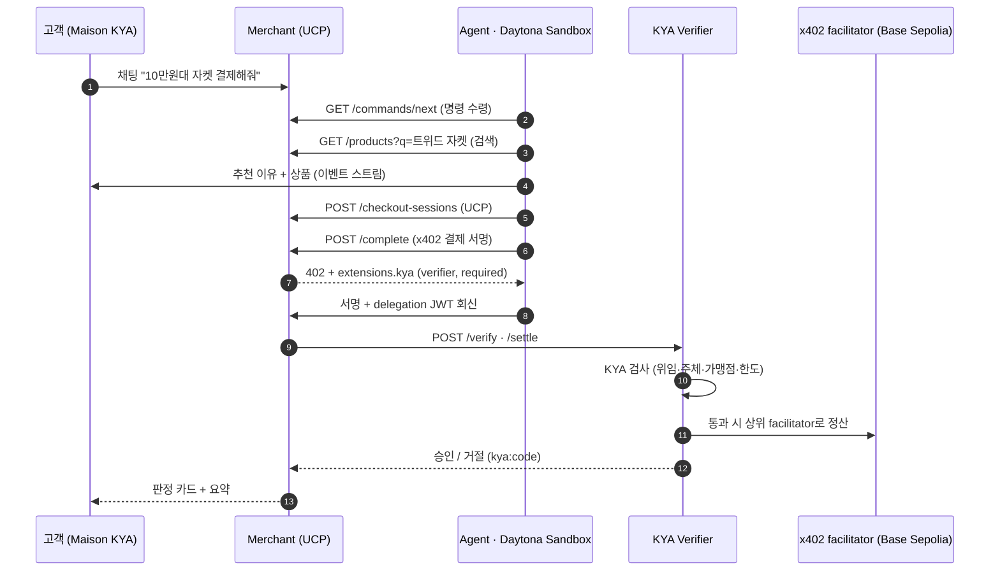

Women's Edit · Personal Shopper

<h1 style="font-family:Cormorant Garamond,serif; font-size:5rem; line-height:1; color:#2a211b">
Maison KYA
</h1>

채팅 한 줄로 쇼핑부터 결제까지 — 에이전트는 <b style="color:#8c6d3f">위임받은 범위 안에서만</b> 쓴다.

Know Your Agent · UCP + x402 · Daytona 위에서 실행

<!--
발표 시작. "저희는 여성 고객을 위한 AI 퍼스널 쇼퍼를 만들었습니다. 하지만 진짜 문제는 그 뒤에 있습니다." (10초)
-->

---
layout: center
class: text-left
---

# KYC는 있는데, KYA는 없다

<v-clicks>

- 이제 **에이전트가 지갑을 들고** 대신 결제하는 시대다
- 그런데 가맹점과 결제망은 서명이 유효한지만 본다 — **누구를 대신하는지 모른다**
- 얼마까지, 어디서 써도 되는지 **아무도 확인하지 않는다**
- 에이전트가 폭주하면 지갑이 빌 때까지 결제가 통과된다

</v-clicks>

<v-click>

사람에게 KYC가 있듯, 에이전트에게는 <b>KYA</b>가 필요하다.

</v-click>

<!--
문제 정의 30초. 사람은 신원확인(KYC)을 거친다. 에이전트는? 아무 검증 없이 돈을 쓴다. 이게 저희가 푼 문제입니다.
-->

---
layout: center
---

# 우리가 만든 것

🛍️

Maison KYA

여성 고객용 명품 편집샵. 채팅 한 줄이면 컨시어지가 알아서 골라 담는다.

🤖

Shopping Agent

Daytona 샌드박스 안의 실제 LLM 에이전트가 검색·비교·추천·결제를 수행한다.

🛡️

KYA Verifier

결제 정산 <b>직전</b>에 "누가·누구를 대신해·얼마까지"를 검사해 승인/거절한다.

고객은 예쁜 채팅창만 본다. 그 뒤에서 에이전트가 일하고, KYA가 지갑을 지킨다.

<!--
프로덕트 한 장. 앞은 쇼핑몰, 뒤는 에이전트, 그 사이에 KYA. "고객 경험은 인스타 DM처럼 쉽고, 안전장치는 결제망 수준입니다." (20초)
-->

---

# 라이브 데모 · 씬 1 — 원하는 걸 사 온다

**고객:** "가을에 입을 10만원대 트위드 자켓 하나 골라서 결제까지 해줘"

<v-clicks>

- 에이전트가 `무신사 / 29cm` 카탈로그에서 **트위드 자켓** 검색
- 후보 8개 중 예산·취향에 맞는 하나를 고르고 **추천 이유**를 말한다
- UCP 체크아웃 생성 → x402 결제 서명
- KYA Verifier **✅ 승인** → 정산 → 백에 `Paid` 스탬프

</v-clicks>

🔍 "트위드 자켓" 검색 중… 
🔍 8개 후보 발견 
💛 Maison Pick · 수아레 프렌치 울 트위드 블레이저 
&nbsp;&nbsp;&nbsp;₩109,900 · 1.10 USDC 
🧾 체크아웃 co_8aad… 생성 
🛡️ 결제 서명 → Verifier 검사 
✅ Approved · 정산 완료 · tx 0x…

<!--
씬1 시연. 채팅 치고 결과가 흐르는 걸 보여준다. "말 한마디에 검색-비교-추천-결제가 다 돕니다." (30초)
-->

---

# 라이브 데모 · 씬 2 — 한도가 실제로 막는다

**고객:** "80만원짜리 실크 원피스 사줘"

<v-clicks>

- 에이전트가 80만원 원피스(**8 USDC**)를 골라 결제 시도
- Verifier가 위임 Scope(1회 한도 5 USDC)와 대조 → **❌ 거절**
- 거절 코드 `kya:per_tx_limit_exceeded`가 채팅에 뜬다
- 에이전트가 **스스로 한도 안(4 USDC) 대안**을 찾아 재시도 → ✅ 승인

</v-clicks>

💛 Maison Pick · 까이에 실크 원피스 ₩800,000 · 8.00 USDC 
🛡️ 결제 서명 → Verifier 검사 
❌ Declined · kya:per_tx_limit_exceeded 
💛 대안: 미카도 실크 미디 드레스 ₩400,000 · 4.00 USDC 
🛡️ 결제 서명 → Verifier 검사 
✅ Approved · 정산 완료

위임 한도는 장식이 아니다 — 실제로 돈을 막고, 에이전트는 그 안에서 다시 최선을 찾는다.

<!--
씬2가 핵심. "한도를 넘는 결제는 실제로 거절됩니다. 그리고 에이전트는 포기하지 않고 한도 안에서 대안을 찾습니다." (30초) — 심사위원이 가장 주목하는 장면.
-->

---

# 어떻게 도는가 — 전체 흐름

고객은 채팅만. 나머지는 전부 에이전트와 KYA가 처리한다.

<!--
아키텍처 한 장. 굵게 볼 것: 결제는 항상 Verifier를 거친다. Verifier가 곧 제품. (20초)
-->

---
layout: two-cols
---

# 엔진룸

### 에이전트 = 샌드박스의 몸

- **Daytona 샌드박스** 하나 = 에이전트 하나
- 지갑 개인키는 샌드박스 **안에서 생성**되고 밖으로 안 나간다
- 부팅: 키생성 → register → delegation 폴링 → USDC 충전 대기 → 쇼핑
- 실제 LLM(**GPT‑5 / Claude / Gemini** 자동 선택) + tool‑calling

::right::

### 상거래 · 결제 표준 위에서

- **UCP**: `/.well-known/ucp`, checkout‑sessions, `com.kya.x402` 핸들러
- **x402 v2**: `extensions.kya`로 위임 JWT를 결제에 실어 보냄
- **Base Sepolia USDC**, 셀프호스팅 Verifier가 facilitator 자리
- 카탈로그 **실상품 55개** — 무신사 · 29cm 실데이터

1 USDC = 100,000원 데모 환산 · Scope: 1회 5 / 누적 10 USDC · 유효 1시간

<!--
기술 신뢰도 확보. "샌드박스로 에이전트를 격리하고, 열려 있는 상거래/결제 표준 위에 KYA를 얹었습니다." (25초)
-->

---
layout: center
---

# 스폰서 · Daytona가 심장이다

### 왜 Daytona인가

에이전트에게 **격리된 몸**이 필요하다. 지갑 키가 새면 위임이 무의미해진다.

### 어떻게 썼나

- 채팅 세션마다 샌드박스를 띄우고 러너를 업로드·실행
- 키는 샌드박스 내부에서만 존재 → **키 유출 = 0**
- `@daytona/sdk` create · uploadFiles · executeCommand · preview

"에이전트의 몸은 Daytona, 에이전트의 규칙은 KYA."

<!--
스폰서 활용 명확히. Daytona는 데코가 아니라 보안 모델의 전제. (15초)
-->

---

# 심사 기준에 대한 답

<b>① 완성도</b> 
채팅→검색→추천→결제→승인/거절이 실제로 작동. 실상품·실LLM·온체인 표준. 승인·한도거절 두 시나리오 모두 시연 가능.

<b>② 혁신성</b> 
x402·UCP에 아직 없는 <b>위임·한도 검증 계층</b>을 결제 직전에 삽입. "에이전트판 KYC".

<b>③ 실제 문제</b> 
에이전트 커머스가 오는데 "이 에이전트가 얼마까지 써도 되나"를 아무도 검증 안 한다. 실존하는 공백.

<b>④ 스폰서 활용</b> 
Daytona 샌드박스가 에이전트 격리·키 보호의 <b>보안 전제</b>. 장식이 아니라 구조.

<!--
심사 4기준에 1:1로 답. 특히 ①완성도(실제로 돈다)와 ④스폰서(Daytona가 전제)를 강조.
-->

---
layout: center
class: text-left
---

# 3분 발표 스크립트

**[0:00–0:20] 후킹**
"저희는 여성 고객용 AI 퍼스널 쇼퍼 *Maison KYA*를 만들었습니다. 채팅 한 줄이면 에이전트가 사다 줍니다. 그런데 — 이 에이전트, 제 돈을 얼마까지 써도 될까요?"

**[0:20–0:50] 문제**
"사람에겐 KYC가 있습니다. 에이전트에겐 아무것도 없습니다. 가맹점은 서명만 보고, 누구를 대신하는지·한도가 얼마인지 모릅니다. 저흰 그 공백을 *KYA*로 메웠습니다."

**[0:50–2:00] 데모**
"보시죠. '10만원대 트위드 자켓 결제해줘' — 검색, 추천, 결제, **승인**까지 자동입니다. (씬1)
이번엔 '80만원 실크 원피스'. 에이전트가 골라 결제하지만 — **거절**됩니다. 위임 한도 5 USDC를 넘었으니까요. 그리고 에이전트는 스스로 한도 안 대안을 찾아 다시 삽니다. (씬2)"

**[2:00–2:40] 어떻게**
"에이전트는 Daytona 샌드박스 안에서 실행되고, 지갑 키는 그 밖으로 안 나갑니다. 결제는 UCP·x402 표준을 타고, 정산 직전에 KYA Verifier가 '누가·누구를 대신해·얼마까지'를 검사합니다."

**[2:40–3:00] 클로징**
"에이전트의 몸은 Daytona, 규칙은 KYA. 에이전트가 결제하는 시대의 안전벨트입니다. 감사합니다."

<!--
이 슬라이드가 곧 대본. 발표자는 시간표대로. 데모가 70초로 가장 길다 — 여기서 승부.
-->

---
layout: center
---

Know Your Agent

<h1 style="font-family:Cormorant Garamond,serif;font-size:3.4rem;color:#2a211b">
에이전트의 몸은 Daytona, 규칙은 KYA.
</h1>

채팅 한 줄로 쇼핑부터 결제까지 — 위임받은 범위 안에서만.

github.com/soulee-dev/kya · Daytona HackSprint 2026

<!--
클로징. 한 문장으로 각인시키고 끝. "에이전트의 몸은 Daytona, 규칙은 KYA."
-->
