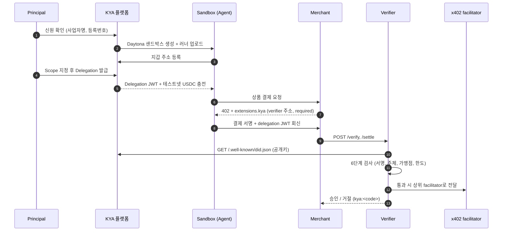
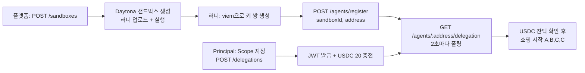

# KYA
## Know Your Agent

에이전트가 결제하기 **직전**에, 누구를 대신해 어떤 범위 안에서 행동하는지 검증한다

<div class="pt-12 text-sm opacity-60">
UCP + x402 위에 얹히는 위임 검증 계층 · DID 기반
</div>

---
layout: center
---

# 문제

<v-clicks>

- 에이전트가 지갑을 들고 결제하러 간다
- Merchant는 서명이 유효한지만 본다. **누구를 대신하는지는 모른다**
- 얼마까지 써도 되는지, 어디서 써도 되는지도 **아무도 확인하지 않는다**
- 에이전트가 폭주하면 지갑이 빌 때까지 결제가 통과된다

</v-clicks>

---
layout: center
---

# 한 문장 요약

<div class="text-2xl leading-relaxed">

검증된 **Principal**(사람 또는 사업자)이<br>
**Agent**(지갑 주소)에게 **Scope**가 붙은 **Delegation**을 발급하고,<br>
**Verifier**가 결제 정산 직전에 그 Delegation을 검사해<br>
**승인 또는 거절**을 판정한다.

</div>

---

# 등장인물

| 이름 | 역할 | 식별자 |
|---|---|---|
| **Principal** | 지출 권한을 위임하는 검증된 실체. 자연인 또는 사업자 | `did:web:<host>:principals:<id>` |
| **Agent** | Principal을 대신해 상품을 고르고 결제하는 프로그램. 샌드박스 안에서 실행 | `did:pkh:eip155:84532:0x…` (지갑 주소) |
| **Merchant** | 상품을 팔고 x402로 결제를 요구하는 쪽 | payTo 주소 |
| **Verifier** | 정산 직전에 Delegation과 Scope를 검사하는 KYA 계층. x402 facilitator 자리에 선다 | `https://<kya-host>` |
| **KYA 플랫폼** | 신원 확인, 샌드박스 생성, Delegation 발급, 자금 충전 | `did:web:<host>` |

<div class="mt-6 text-sm opacity-70">
Merchant와 Agent 러너는 팀원 담당. KYA 플랫폼과 Verifier가 이 발표의 범위.
</div>

---

# 전체 흐름



---
layout: two-cols
---

# DID 두 종류

### 발급자: `did:web`

플랫폼이 HTTPS 도메인으로 자기 신원을 증명한다.

- 플랫폼 DID: `did:web:kya.example.com`
- Principal DID: `did:web:kya.example.com:principals:8f2c1a4e`
- 공개키 문서: `GET /.well-known/did.json`
- 서명 알고리즘: EdDSA (Ed25519)

::right::

### 에이전트: `did:pkh`

지갑 주소 자체가 DID가 된다. 별도 등록이 필요 없다.

```
did:pkh:eip155:84532:0xab12…ef90
        └──┬───┘ └─┬─┘ └────┬────┘
       method  chain    address
```

- 체인: Base Sepolia (`eip155:84532`)
- JWT의 `sub`에 들어간다
- x402 결제 서명의 `from` 주소와 **반드시 일치**해야 한다
- 이 일치가 곧 **소지 증명**이다

---

# did.json: 검증 키 공개

플랫폼이 Ed25519 키를 만들어 보관하고, 공개키만 DID 문서로 노출한다.

```json
{
  "@context": ["https://www.w3.org/ns/did/v1", "https://w3id.org/security/suites/jws-2020/v1"],
  "id": "did:web:kya.example.com",
  "verificationMethod": [{
    "id": "did:web:kya.example.com#key-1",
    "type": "JsonWebKey2020",
    "controller": "did:web:kya.example.com",
    "publicKeyJwk": { "kty": "OKP", "crv": "Ed25519", "x": "…" }
  }],
  "assertionMethod": ["did:web:kya.example.com#key-1"]
}
```

<v-click>

Verifier는 JWT의 `iss`만 보고 문서 위치를 스스로 계산한다.

```
did:web:kya.example.com:principals:8f2c1a4e
  → 호스트 부분만 취함 → https://kya.example.com/.well-known/did.json
```

</v-click>

---

# Delegation JWT

Principal 키로 서명된 Verifiable Credential 형식. Agent가 소지한다.

```json {all|2,3|4-6|10-16|all}
{
  "iss": "did:web:kya.example.com:principals:8f2c1a4e",
  "sub": "did:pkh:eip155:84532:0xab12…ef90",
  "jti": "5d1e…",  "iat": 1758260000,  "exp": 1758263600,
  "vc": {
    "type": ["VerifiableCredential", "AgentDelegation"],
    "credentialSubject": {
      "id": "did:pkh:eip155:84532:0xab12…ef90",
      "sandboxId": "daytona-…",
      "principal": { "entityType": "business", "name": "Acme Corp", "verifiedAt": "…" },
      "scope": {
        "network": "eip155:84532",
        "asset": "0x036CbD53842c5426634e7929541eC2318f3dCF7e",
        "perTxLimit": "5000000",
        "cumulativeLimit": "10000000",
        "merchants": ["0x<merchant payTo>"]
      }
    }
  }
}
```

<div class="text-sm opacity-70 mt-2">
헤더 kid = <code>did:web:kya.example.com#key-1</code> · 금액은 USDC atomic 단위 문자열 (1 USDC = "1000000")
</div>

---

# x402 확장 `kya`: Merchant 코드를 건드리지 않는다

<div class="grid grid-cols-2 gap-6">

<div>

### Merchant의 402 응답

```json
{
  "x402Version": 2,
  "accepts": [{ "scheme": "exact",
    "network": "eip155:84532",
    "amount": "3000000",
    "payTo": "0x<merchant>" }],
  "extensions": {
    "kya": {
      "info": { "verifier": "https://<kya>",
                "required": true },
      "schema": { "type": "object",
        "properties": {
          "delegation": { "type": "string" } } }
    }
  }
}
```

</div>

<div>

### Agent의 결제 페이로드

```json
{
  "x402Version": 2,
  "payload": {
    "signature": "0x…",
    "authorization": {
      "from": "0xab12…ef90",
      "to": "0x<merchant>",
      "value": "3000000" }
  },
  "extensions": {
    "kya": {
      "info": { "verifier": "…",
                "required": true,
                "delegation": "<JWT>" }
    }
  }
}
```

</div>

</div>

<v-click>

<div class="mt-2 text-sm">
Merchant는 <code>@x402/hono</code> 미들웨어의 facilitator URL을 <b>Verifier</b>로 바꾸기만 하면 된다. Delegation은 페이로드 안에 실려 온다.
</div>

</v-click>

---

# Verifier는 facilitator 자리에 선다

x402 facilitator와 인터페이스가 같다. 앞에 KYA 검사를 한 단계 끼워 넣을 뿐이다.

| 엔드포인트 | 동작 |
|---|---|
| `GET /supported` | 상위 facilitator 응답에 `extensions: ["kya"]`를 덧붙인다 |
| `POST /verify` | KYA 검사 → 통과 시 상위 `/verify`로 그대로 전달. 실패 시 `{ isValid: false, invalidReason: "kya:<code>" }` |
| `POST /settle` | KYA 검사 → 상위 `/settle` 전달 → `success: true`면 **Spend Ledger**에 `jti`별로 가산 |
| `GET /decisions` | 판정 목록. UI가 폴링한다 |
| `GET /ledger/:jti` | Delegation 하나의 누적 지출 |

<v-click>

<div class="mt-4 p-3 rounded bg-yellow-500/10 text-sm">
<b>KYA_SETTLE_MODE=mock</b>: 검사만 수행하고 상위 호출 없이 <code>0xmock…</code> 트랜잭션을 돌려준다. 무대 데모용 안전장치.
</div>

</v-click>

---

# 6단계 검사

순서대로 검사하고, 첫 번째로 걸리는 단계의 코드로 거절한다.

<v-clicks>

1. `extensions.kya.info.delegation` 없음 → **`kya:missing_delegation`**
2. JWT 서명 또는 `exp` 검증 실패 (did.json 공개키로 EdDSA 검증) → **`kya:invalid_delegation`**
3. `sub` 주소 ≠ `payload.authorization.from` → **`kya:subject_mismatch`**
4. `paymentRequirements.payTo` ∉ `scope.merchants` → **`kya:merchant_not_allowed`**
5. `amount` > `perTxLimit` → **`kya:per_tx_limit_exceeded`**
6. `ledger[jti] + amount` > `cumulativeLimit` → **`kya:cumulative_limit_exceeded`**

</v-clicks>

<v-click>

<div class="mt-4 text-sm opacity-70">
1~2번이 "누가 발급했나", 3번이 "정말 그 에이전트인가", 4~6번이 "허용된 범위 안인가".
</div>

</v-click>

---

# 데모 시나리오: 한도가 실제로 막힌다

Scope: 1회 `5 USDC`, 누적 `10 USDC`, 허용 Merchant 1곳, 유효 1시간

| 순서 | 상품 | 금액 | 누적(정산 후) | 판정 | 이유 |
|---|---|---|---|---|---|
| 1 | A | 3 USDC | 3 | ✅ approved | |
| 2 | B | 8 USDC | 3 | ❌ denied | `kya:per_tx_limit_exceeded` (8 > 5) |
| 3 | C | 4 USDC | 7 | ✅ approved | |
| 4 | C | 4 USDC | 7 | ❌ denied | `kya:cumulative_limit_exceeded` (7 + 4 > 10) |

<v-click>

거절된 결제는 Spend Ledger에 오르지 않는다. 승인된 두 건만 합산되어 `7000000`이 남는다.

각 판정은 `Decision` 카드로 남는다: `{ at, phase, jti, payer, payTo, amount, decision, reason, txHash?, principal }`

</v-click>

---

# 샌드박스 부팅 순서

Agent는 Daytona 샌드박스 안에서만 실행된다. 개인키는 메모리에만 있다.



<div class="mt-4 text-sm">

주입 환경 변수: `KYA_URL`, `MERCHANT_URL`, `SANDBOX_ID`, `ANTHROPIC_API_KEY`, `SHOPPING_LIST`

</div>

---

# 구현 구조

```
packages/core        도메인 라이브러리 (@kya/core)
  did.ts             did:web / did:pkh 헬퍼, DID 문서 생성·조회
  keys.ts            Ed25519 키 생성·보관
  delegation.ts      JWT 발급, did:web 해석(60초 캐시), 검증
  check.ts           6단계 검사 → ok | { code, detail }
  ledger.ts          Spend Ledger (jti별 누적, JSON 파일)
  verifier.ts        facilitator 프록시 + Decision 기록 + mock 모드
  funding.ts         treasury 지갑에서 USDC 송금 (viem)
  sandbox.ts         Daytona SDK 래퍼

apps/verifier        Hono. /supported /verify /settle /decisions /ledger
apps/web             Next.js. 발급 콘솔 + /.well-known/did.json /principals /sandboxes
                     /agents/register /agents/:addr/delegation /delegations /state
```

<div class="text-sm opacity-70 mt-2">
단위 테스트 12개 · scenario / fake-agent / e2e 스크립트로 발급 → did.json 조회 → 검증까지 확인
</div>

---

# 한계와 다음 단계

<div class="grid grid-cols-2 gap-8">

<div>

### 지금은 이렇게 제한된다

- 신원 확인은 스텁이다. 사업자번호를 실제로 조회하지 않는다
- did:web은 호스트당 키 하나. 회전과 폐기가 없다
- did:pkh는 별도 서명 없이 x402 결제 서명의 `from`으로만 대조한다
- Spend Ledger는 Verifier 한 대의 JSON 파일이다

</div>

<div>

### 다음에 붙일 것

- 실제 KYB 제공자 연동
- Delegation 폐기 목록 (jti 기준)
- 상품 카테고리 Scope (Merchant 신고값 기준)
- 여러 Verifier가 공유하는 원장
- 결제 프로토콜 확장: x402 외 다른 rail

</div>

</div>

---
layout: center
class: text-center
---

# 정리

**Delegation**으로 "누가 허락했는지"를,<br>
**did:pkh 일치**로 "정말 그 에이전트인지"를,<br>
**Scope와 Ledger**로 "허용된 범위 안인지"를<br>
결제 정산 **직전**에 한 번에 검사한다.

<div class="mt-10 text-sm opacity-60">
github.com/soulee-dev/kya
</div>
